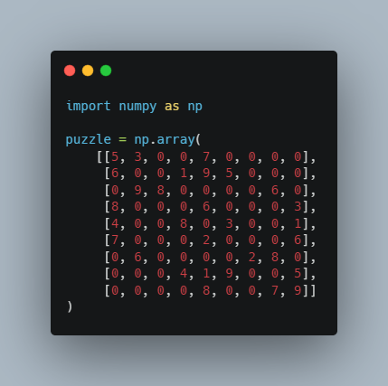
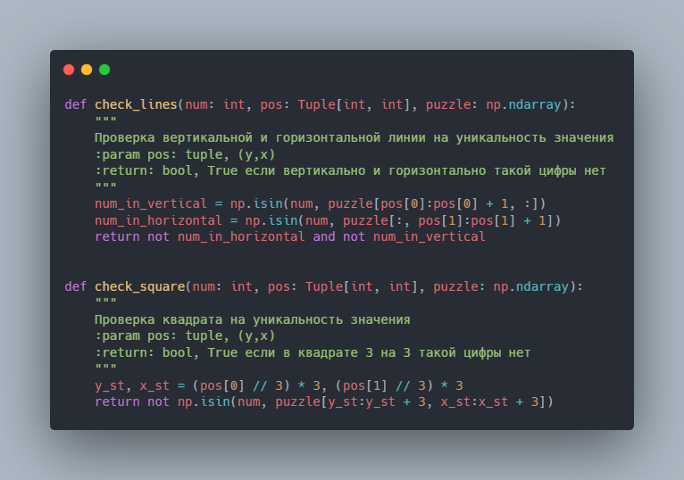
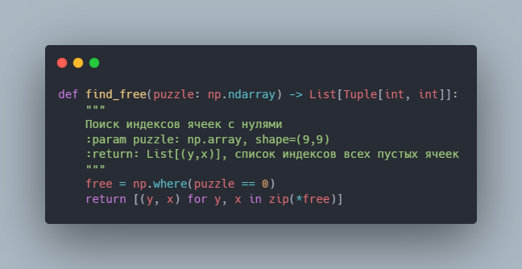
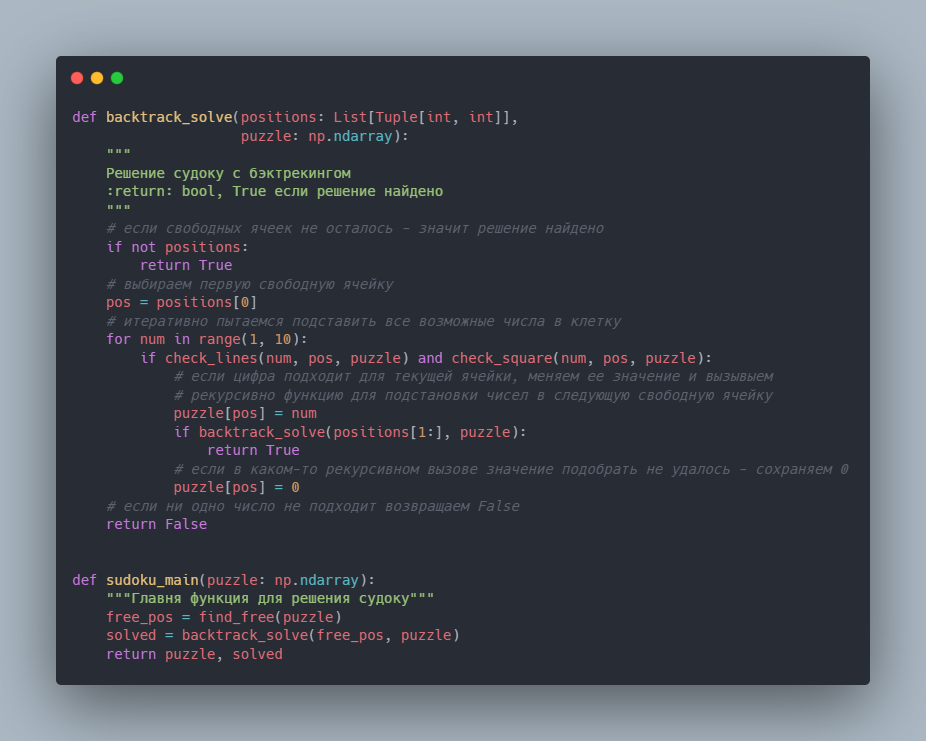
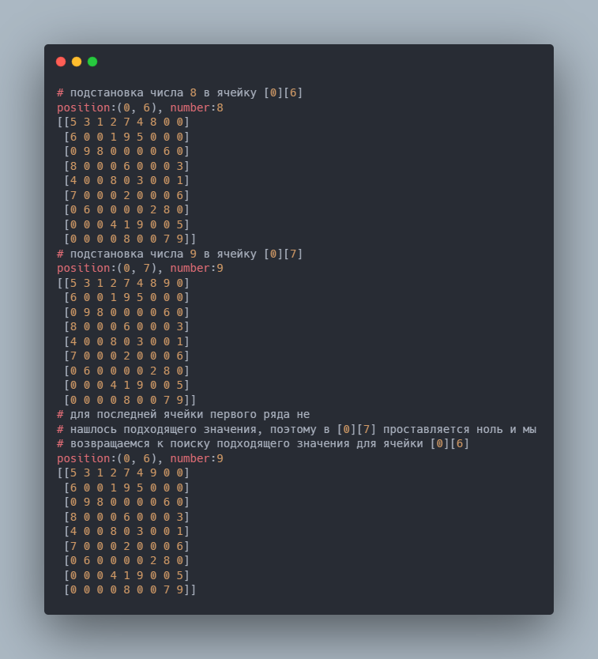

Backtracking - это подход к решению комбинационных задач, который заключается в поиске решений с возможностью вернуться назад при неудачном исходе, по сути тот же метод проб и ошибок. Backtracking может использоваться также в связке с динамическим программированием или быть его частью.

Динамическое программирование - метод решения задачи с помощью разбиения ее на несколько однотипных подзадач,
рекуррентно (рекуррентный - вычисляемый на основе значений предыдущих членов последовательности) связанных между собой.

В чем сила? - В задачах, где нужно найти оптимальный путь или перебрать множество значений, которые связаны между собой,
backtracking дает сильный буст к оптимизации скорости и сложности вычислений. Например, если рассмотреть классический
пример в виде игры Судоку, с полями 9 на 9 клеток, метод грубого перебора в худшем случае займет 9^81 комбинаций (всего
81 клеток, для каждой клетки можно выбрать значения от 1 до 9), сложность O(n^(n^2)), что перебрать практически
нереально. С использованием бэктрекинга это так же будет перебор, но не наивный, а со знанием значений, которые были
выбраны на предыдущих шагах, что для большинства задач будет выполняться намного быстрее, хоть и верхняя граница с
худшим сценарием останется так же O(n^(n^2)).

Теперь, когда разобрались со всеми определениями, можно перейти к технической реализации этого подхода на примере игры в
судоку.

На вход функции будет подаваться numpy массив 9x9 с пропущенными значениями, на выходе решенный судоку, в случае если
решение найдено.

Для начала напишем функции, которые будут проверять возможность подстановки цифры в пустое поле

И функцию для поиска пустых ячеек

После чего уже можно написать функцию с бэктрекингом для решения

Чтобы лучше понять, принцип работы, можно вывести несколько промежуточных значений:

Подбор значений и отброс к предыдущим шагам будет продолжаться до тех пор пока функция не найдет решения или пока не
попробует все возможные комбинации.

Больше статей про алгоритмы, программирование, структуры данных и машинное обучение будет публиковаться на канале https://t.me/algorithmspro
